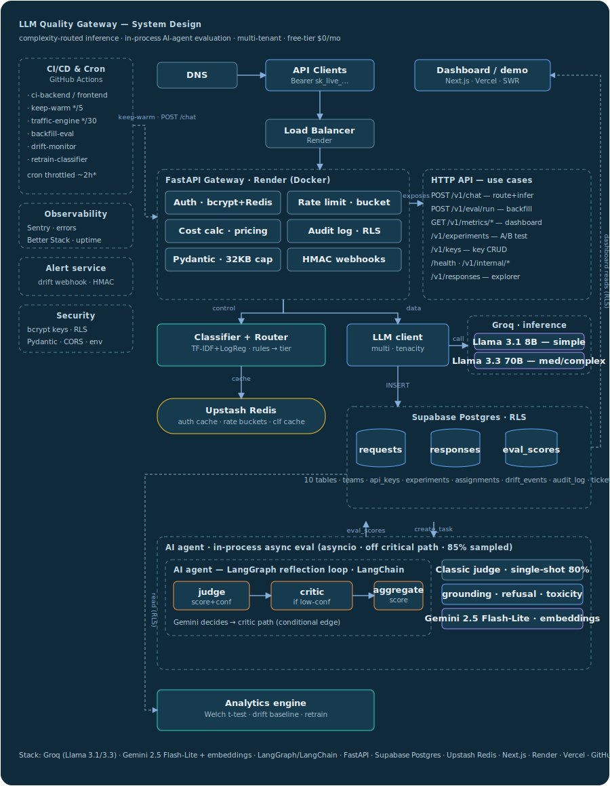

# LLM Quality Gateway

**Production-grade LLM observability platform** with complexity-based routing, async evaluation pipelines, A/B experimentation, and multi-tenant API key auth — built on FastAPI, Next.js 14, Supabase, and Upstash. Fully deployed on free-tier infrastructure with zero ongoing cost.

---

## What It Does

Most teams send every prompt to the same model. This gateway classifies each request by complexity, routes it to the cheapest model that can handle it, and asynchronously scores every response with an LLM-as-judge evaluator — giving you quality metrics, cost attribution, and A/B experiment results without adding latency to the critical path.

**Live demo:** [llm-gateway-lemon.vercel.app/demo](https://llm-gateway-lemon.vercel.app/demo)  
**API:** [llm-gateway-6xsv.onrender.com/health](https://llm-gateway-6xsv.onrender.com/health)

---

## Architecture



**Request path:** clients (and the GitHub Actions traffic engine) hit the FastAPI gateway on Render — auth (bcrypt, Redis-cached) → rate limit → TF-IDF/LogReg complexity classifier → router → Groq Llama 3.1 8B (simple) or 3.3 70B (medium/complex) → persist to Supabase. The response returns with under 500ms of gateway overhead.

**Evaluation path (off the critical path):** after the response is returned, an in-process `asyncio` background task scores a sampled fraction of responses. 20% run through an **AI agent** — a LangGraph reflection loop (`judge → conditional critic → aggregate`) on Gemini 2.5 Flash-Lite — while the rest use a single-shot judge; grounding uses Gemini embeddings. Scores land in `eval_scores`, which the stats engine (Welch's t-test, drift baselines) and the dashboard read via row-level security.

---

## Key Engineering Decisions

### 1. Hybrid Complexity Classifier

A two-stage classifier avoids the latency of calling an LLM to classify complexity:

1. **Rule-based fast path** — keyword + structural heuristics catch unambiguous complex cases (multi-step requests, escalations) in microseconds
2. **TF-IDF + Logistic Regression** — trained on **55k diverse instruction prompts** (Alpaca + Dolly), domain-agnostic so it generalizes beyond any single use case

The model was selected rigorously: a 70/15/15 train/val/test split with 5-fold cross-validation, comparing three classifiers (Multinomial Naive Bayes, Logistic Regression, LinearSVC). Logistic Regression won on validation macro-F1 and scored **0.95 weighted F1 / 0.85 macro-F1** on the held-out test set. Full metrics (per-class precision/recall, confusion matrix, top features) are written to `classifier_metrics.json` and surfaced on the `/health` endpoint.

If the model fails to load (e.g. a library version skew in prod), classification **fails open** to the rule-based path rather than crashing the gateway. The trained model ships as `classifier.pkl` — no cold-start retraining on Render — and a weekly job retrains it on production eval feedback.

```
simple  → llama-3.1-8b-instant   (~$0.05/M tokens)
medium  → llama-3.3-70b-versatile (~$0.59/M tokens)
complex → llama-3.3-70b-versatile + priority routing
```

Result: ~40% cost reduction vs. always routing to 70B.

### 2. Async Eval Pipeline (No Added Latency)

The eval pipeline runs entirely off the critical path — **in-process**, with no external queue:

1. Response returns to client immediately
2. `asyncio.create_task()` fires a fire-and-forget background evaluation
3. A sampled fraction (`EVAL_SAMPLE_RATE`, default 85%) is scored; the rest are skipped
4. Gemini 2.5 Flash-Lite scores: `quality = 0.5×accuracy + 0.3×helpfulness + 0.2×tone`
5. Flags hallucinations (embedding-based grounding), refusals, and toxicity
6. Writes to the `eval_scores` table in Supabase

A daily backfill job (`POST /v1/eval/run`) re-scores any responses missed if the gateway restarted mid-eval.

> **Design note:** this started as a QStash-backed queue with signed callbacks. On a single-instance free-tier deploy the queue added an external dependency with no real benefit over an in-process background task — so it was removed. See the [Tradeoffs](#tradeoffs) section.

### 2a. Agentic Evaluation (LangGraph reflection loop)

20% of sampled evals (`AGENTIC_EVAL_SAMPLE_RATE`) run through an **AI agent** instead of the single-shot judge — a LangGraph `StateGraph` implementing the reflection pattern:

```
judge ──▶ (conditional edge) ──▶ critic ──▶ aggregate
                │
                └── judge confident? ──────▶ aggregate
```

The judge scores the response and reports its own confidence; a **conditional edge** invokes an independent **critic** only on low-confidence or low-accuracy cases, and the critic can override before the score is aggregated. Control flow is driven by the model's output, not a fixed script. Agentic rows are tagged `evaluator_model = gemini-2.5-flash-lite+langgraph-reflection` so the critic-override rate is queryable.

### 3. A/B Experimentation Engine

SHA-256 hash of `(team_id + experiment_id + request_id)` for deterministic, reproducible assignment — same request always goes to the same variant. No sticky sessions needed.

Auto-concludes experiments when sample size is reached using **Welch's t-test** (unequal variance):
- `p < 0.05` → declare winner
- `|effect_size| < 0.02` → call it a tie
- Stores p-value, effect size, and winner in Supabase for audit trail

### 4. Multi-Tenant Auth

- API keys are `sha256(random_bytes(32))` with a 12-char prefix for lookup
- Stored as **bcrypt hashes** — plaintext shown once on creation, never stored
- Auth results cached in Redis for 60s to avoid re-hashing on every request
- Per-team rate limiting: 60 req/min + 1000 req/hr via Redis pipeline (atomic increment + expire)

### 5. Zero-Cost Persistent Deployment

The entire stack runs forever on free tiers:

| Service | Free Limits | How We Stay Within |
|---|---|---|
| Render | 750h/month, spins down after 15min idle | GitHub Actions pings `/health` every 5 min |
| Supabase | 500MB, pauses after 7 days idle | Same keep-warm hits DB on every ping |
| Upstash Redis | 10k commands/day | Auth cache + rate limit only (< 200 commands/request) |
| Upstash QStash | 500 messages/day | 85% sample rate + burst of 12 every 30 min = ~340/day |
| Groq | 14,400 tokens/min | Traffic engine throttled to 12 req/30min |
| Gemini | 1,500 req/day | Eval sample rate caps usage |
| Vercel | Unlimited hobby | Static + server components, no serverless functions abuse |

---

## Stack

**Backend:** Python 3.11 · FastAPI · Pydantic Settings · Supabase (Postgres) · Upstash Redis · Upstash QStash · Groq SDK · Gemini API · scikit-learn · scipy · bcrypt · tenacity · structlog · Sentry

**Frontend:** Next.js 14 · TypeScript · Tailwind CSS 4 · Recharts · SWR · shadcn/ui

**Infra:** Render (backend) · Vercel (frontend) · Supabase (DB + auth) · GitHub Actions (cron)

---

## Database Schema

Seven tables with Row-Level Security on every one:

```
teams               — multi-tenant root
api_keys            — bcrypt-hashed keys, prefix-indexed
requests            — every gateway call with complexity + cost + latency
responses           — LLM output, linked to request
eval_scores         — quality/hallucination/refusal/toxicity per response
experiments         — A/B test config with hypothesis + traffic split
experiment_assignments — deterministic variant assignment log
drift_events        — statistical drift alerts (PSI-based)
audit_log           — append-only action log per team
```

Service role key used server-side (bypasses RLS). Dashboard queries use team-scoped JWT (RLS enforced).

---

## GitHub Actions Automation

| Workflow | Schedule | Purpose |
|---|---|---|
| `keep-warm` | every 5 min | Pings `/health` + keep-warm endpoint to prevent Render/Supabase sleep |
| `traffic-engine` | every 30 min | Sends 12 realistic prompts (70% simple / 25% medium / 5% complex) |
| `backfill-eval` | daily 3am UTC | Catches any evals that failed or were missed during the day |
| `ci-backend` | on push to `backend/**` | Runs pytest — no real secrets needed, conftest sets all defaults |

All cron workflows gated on `vars.BACKEND_DEPLOYED == 'true'` so they don't run before the backend is live.

---

## Local Development

```bash
# Backend
cd backend
python -m venv .venv && source .venv/bin/activate
pip install -e ".[dev]"
cp ../.env.example ../.env  # fill in your keys
uvicorn app.main:app --reload

# Frontend
cd frontend
npm install
npm run dev
```

```bash
# Run tests (no real secrets needed)
cd backend && pytest tests/ -v

# Bootstrap demo team + API key (run once after deploy)
SUPABASE_URL=... SUPABASE_SERVICE_KEY=... python backend/scripts/bootstrap_demo.py

# Drive traffic manually
DEMO_API_KEY=sk_live_... API_URL=https://... python backend/scripts/drive_traffic.py
```

---

## API Reference

```
GET  /health                          # {"status":"ok","db":"ok","redis":"ok"}
GET  /v1/metrics/public               # Demo team metrics, no auth required

POST /v1/chat                         # Main gateway endpoint
  Authorization: Bearer sk_live_...
  {"prompt": "my subscription renewal failed"}
  → {"id":"...","content":"...","model_used":"llama-3.1-8b-instant",
     "complexity":"simple","cost_usd":0.000012,"latency_ms":312,"eval_status":"queued"}

GET  /v1/metrics/overview             # 24h stats for your team
GET  /v1/metrics/distribution         # Complexity breakdown (7 days)
GET  /v1/experiments                  # Active A/B experiments
POST /v1/keys                         # Create new API key
```

All responses: `{"data": {...}, "error": null}` or `{"data": null, "error": {"code":"...","message":"..."}}`

---

## Tradeoffs

Every decision here was a deliberate choice with a cost. The interesting ones:

| Decision | Why | Tradeoff accepted |
|---|---|---|
| **In-process eval vs external queue (QStash)** | On a single-instance free-tier deploy, a managed queue added an external dependency and a failure mode (it silently 404'd for a month) with no real benefit over an `asyncio` background task. | If the process restarts mid-eval, that eval is lost — mitigated by the daily backfill job rather than the queue's built-in retries. |
| **Rule + ML classifier vs an LLM classifier** | A TF-IDF + LogReg model classifies complexity in microseconds with no API call, so routing adds ~no latency and no quota cost. | Lower ceiling than an LLM classifier on nuanced prompts; mitigated by a rule-based fast path and a fail-open fallback. |
| **AI agent: reflection loop vs autonomous tool-use** | The eval task is bounded and has a hard latency budget and a 15 req/min Gemini free-tier ceiling. A fixed `judge → conditional critic → aggregate` graph gives self-correction without an open-ended loop that multiplies LLM calls. | Not a general tool-using agent — deliberately scoped. The critic only runs on low-confidence cases (~cost control), so borderline-but-confident errors can slip through. |
| **Groq free tier vs Anthropic Messages API** | The project must run at $0/month forever; Groq's free tier is the most generous. The gateway is provider-agnostic (`llm_client` abstraction), so swapping in the Anthropic Messages API is a config change. | Groq's models are less capable than frontier models; fine for the customer-support eval domain this is calibrated on. |
| **Attributed cost vs actual cost** | Free-tier usage is metered to $0, but a cost-savings story needs real prices — so cost is *attributed* at published developer-tier rates. | The dashboard's dollar figures are modeled, not billed; labeled as such. |
| **GitHub Actions cron vs a real scheduler** | Free and requires no extra infra. | GitHub throttles free-tier schedules hard — `*/5` actually fires every ~2h. Fine for keeping the DB alive (7-day idle limit); a Better Stack uptime ping covers true always-warm. |

## What I'd Add With More Time

- **Streaming responses** — SSE endpoint for real-time token streaming
- **Prompt versioning** — store and diff prompt templates, tie eval scores to versions  
- **Cost forecasting** — linear regression on rolling 7-day spend to project monthly cost
- **Webhook alerts** — POST to Slack/Discord when quality drops below threshold or drift detected
- **Fine-tuned classifier** — replace TF-IDF with a small BERT fine-tuned on domain data
- **Feedback loop** — use eval scores as training signal to continuously improve routing thresholds
